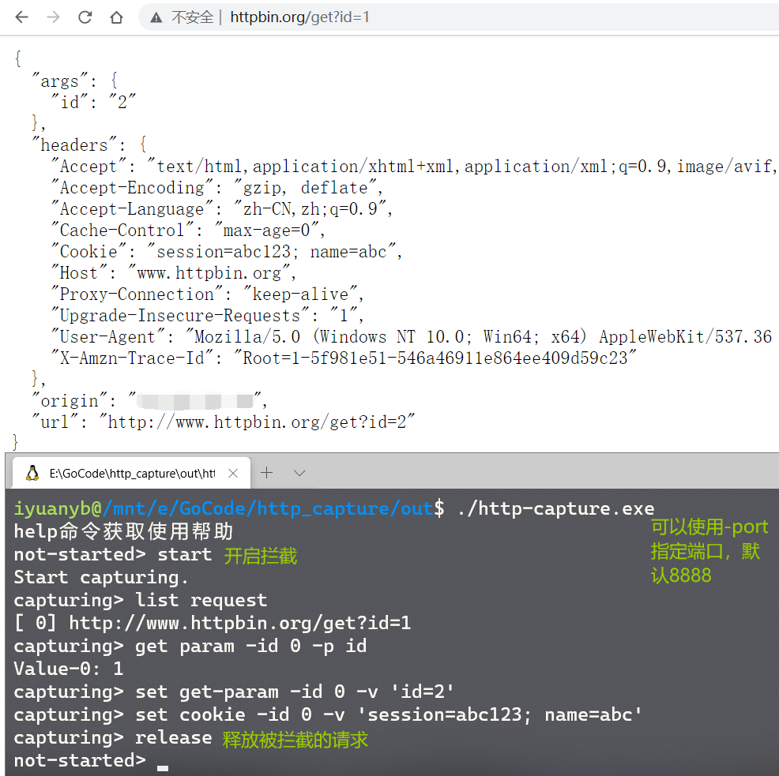

Go实现的一个命令行HTTP抓包工具

> 可以对HTTP（暂不支持HTTPS）请求做拦截，并修改请求信息。
> 只会拦截POST请求及部分非GET请求，对一些JS、CSS等静态资源请求不会拦截。

### 命令：
- **start:**
    - `start`                  进入抓包拦截状态
- **exit:**
    - `exit`                   退出程序
- **release:**
    - `release`                                释放所有请求
- **list:**
    - `list request`           列出当前拦截的所有请求及对应ID
    - `list header -id reqId`  列出某个请求的所有Header
- **get:**
    - `get header -id reqId -h key`   获取某个请求的某个Header
    - `get param -id reqId -p key`    获取某个请求的某个参数(GET&POST)
    - `get cookie -id reqId [-c key]` 获取某个请求的Cookie，不提供-c则获取所有Cookie
    - `get body -id reqId`            获取某个请求的Body，仅对POST请求有效
- **set:**
    - `set header -id reqId -v k=v`      设置某个请求的某个Header
    - `set get-param -id reqId -v k=v`  设置某个请求的GET参数
    - `set post-param -id reqId -v k=v`  设置某个请求的POST参数，仅对表单请求有效
    - `set cookie -id reqId -v val`      设置某个请求的Cookie
    - `set body -id reqId -v val`        设置某个请求的Body，仅对POST请求有效，可用于修改json
    
### 演示：
> 浏览器需要先设置代理，如 `localhost:8888`

